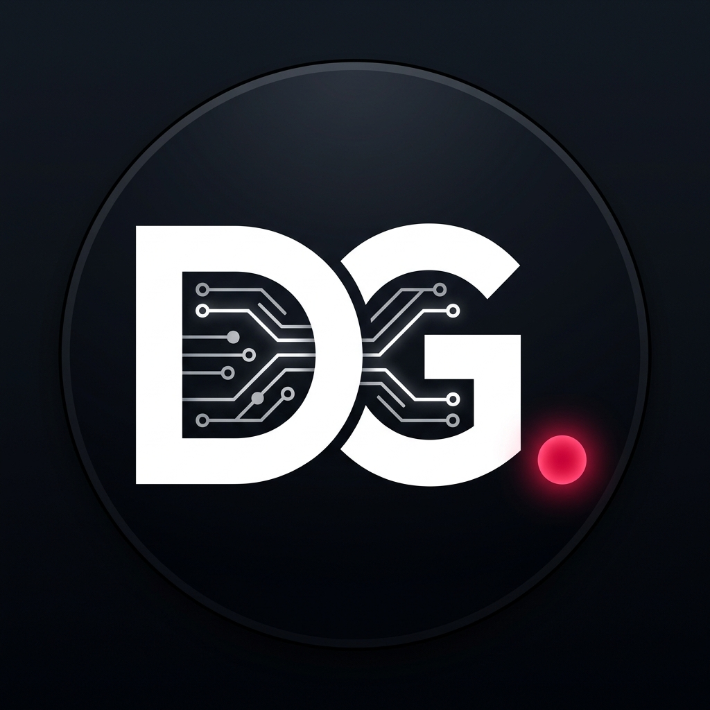

# Daniel Germano — Portfólio Técnico, Pesquisas & Produção Autoral

<p align="center">
  
</p>

<p align="center">
  <strong>Engenharia de Software • Sistemas Embarcados • IA Local na Borda • Editorial Multidisciplinar</strong>
</p>

<p align="center">
  <a href="https://danielgermano-dev.github.io/MeuSite/"></a>
  
  
  
</p>

---

## 🌐 Visão Geral & Apresentação

Bem-vindo ao repositório oficial do portfólio digital e hub de pesquisas de **Daniel Germano Lima dos Santos**. 

Sou graduando em **Engenharia de Software** e formado como **Técnico em Eletrônica** pela *ETEC Júlio de Mesquita*. Minha trajetória profissional e autoral se constrói na intersecção entre o rigor analítico da tecnologia e a capacidade reflexiva da palavra: desde o silício e firmware de microcontroladores em **C/C++** até sistemas backend em **C# (.NET)** e **Python**, automação em **Linux**, orquestração de **modelos de IA locais (Ollama / Qwen 2.5)** e publicações de ensaios filosóficos, históricos e literários.

Este projeto consolida meu portfólio de projetos, plataforma editorial aberta, visualizador de certificações técnicas, hub de recomendações para makers/desenvolvedores e canal de contratação e financiamento contínuo.

---

## ✨ Funcionalidades & Destaques Técnicos

### 1. 🌌 Background Dinâmico com Efeito *Ambient Glass Refraction & Parallax*
- Fundo responsivo com orbes de luz ambiente e malha de refração de vidro fosco (*Frosted Glassmorphism*).
- O ângulo de iluminação, escala e dispersão de luz se adaptam dinamicamente à rolagem (`scroll`) e ao toque (`touchmove`), criando uma sensação táctil tridimensional que reage ao movimento do usuário.
- Otimizado com aceleração por hardware da GPU (`will-change: transform`, `requestAnimationFrame`) e variáveis CSS fluidas.

### 2. 📱 Navegação Retrátil Inteligente (*Smart Header Mobile*)
- **Auto-Hide On Scroll:** O cabeçalho recolhe suavemente ao deslizar para baixo e reaparece instantaneamente ao rolar para cima, liberando 100% do campo visual em telas móveis.
- **Drawer Menu Mobile:** Menu hambúrguer integrado com transições suaves e fechamento automático ao navegar pelos tópicos.
- **Botões de Ação Limpos:** Toggles de idioma e tema integrados ao header sem emojis ou bordas intrusivas, com tipografia limpa e dinâmica.

### 3. 🌍 Motor de Internacionalização 100% Bilíngue (PT-BR / EN-US)
- Alternância instantânea de idioma com persistência em `localStorage`.
- Cobre 100% do ecossistema: cards de projetos, tags técnicas, badges de status (*"Completed"*, *"In Development"*, *"Active / Production"*), resumos de ensaios, itens de afiliados, planos de apoio e certificados.
- Arquitetura desacoplada via atributos declarativos `data-i18n`.

### 4. 🌓 Modos Escuro e Claro (*Adaptive Dual Themes*)
- **Dark Mode (Padrão):** Paleta *OLED Obsidian* profunda com contrastes em vermelho carmesim (`#ff1e27`) e cinza grafite.
- **Light Mode:** Tema minimalista, de alto contraste para ambientes iluminados e leitura prolongada de artigos.

### 5. 📚 Editorial Multidisciplinar com 5 Artigos Dedicados
Espaço autoral estruturado com páginas individuais completas e filtros por categoria:
1. **[Pesquisa Científica]** *Aplicações de LLMs Locais na Borda: Eficiência Energética e Redução de Custos com Qwen 2.5 e Matrix* (`artigo-pesquisa.html` / `artigo-llms.html`).
2. **[Opinião Pessoal / Filosofia]** *A Ilusão da Hiperconectividade e a Fragmentação do Pensamento Crítico* (`artigo-hiperconectividade.html`).
3. **[Fatos Históricos]** *A Descentralização da Informação e a Queda de Paradigmas: Lições da História Moderna* (`artigo-descentralizacao.html`).
4. **[Jornalismo Esportivo]** *A Geometria dos Espaços: Como a Análise Quantitativa e a Tática Redefiniram o Futebol Moderno* (`artigo-futebol-tatico.html`).
5. **[Poemas e Contos]** *O Silêncio dos Transistores & O Eco da Madrugada* (`artigo-silencio-transistores.html`).

### 6. 🏆 Visualizador de Certificados Resiliente & Bilíngue
- 11 certificações técnicas (ETEC, DIO, Santander Open Academy, Senac) com capas em alta definição e links diretos para documentos em PDF/imagem.
- Dados unificados em `lang.js` e `data/certificates.json` para renderização imediata, imune a bloqueios de CORS locais (`file:///`).

### 7. 🛒 Geek & Tech Hub | Recomendações e Afiliados
- 12 itens testados para desenvolvedores e makers: microcontroladores ESP32, kits Arduino, estações de solda, periféricos mecânicos e literatura técnica recomendada (*Clean Code*, *Grokking Algorithms*).
- Política de transparência detalhada e filtros dinâmicos por categoria.

### 8. ☕ Monetização, Planos de Apoio & Pix Instantâneo
- Tiers de apoio (*Leitor Apoiador*, *Patrono de Pesquisa*, *Comissões Técnicas*).
- Botão interativo com cópia em 1 clique para chave Pix (`danielgermano.dev@gmail.com`) e integração a plataformas de fomento (GitHub Sponsors, Apoia.se, Buy Me a Coffee).

---

## 🛠️ Stacks & Tecnologias

| Camada | Tecnologias |
| :--- | :--- |
| **Frontend & UI** | HTML5 Semântico, CSS3 Moderno (Custom Properties, Flexbox, CSS Grid), Vanilla JavaScript (ES6+) |
| **Sistemas & Backend** | Python 3, C / C++, C# (.NET), Bash Shell, Linux SysAdmin |
| **Hardware & IoT** | ESP32, Arduino Uno R3, Raspberry Pi, Sensores Térmicos/Industriais, Displays LCD I2C/SPI |
| **Infra & Soberania** | Docker, Nextcloud (OCC), Protocolo Matrix, Ollama (Qwen 2.5-Coder), Google Gemini API |
| **Design & Assets** | Inkscape, AutoCAD (Desenho Técnico), GIMP, Tipografias *Outfit* e *Space Grotesk* |

---

## 📂 Estrutura de Diretórios

```
MeuSite/
├── index.html                        # Página principal (Hero, Sobre, Stacks, Projetos, Editorial, Loja, Apoio, Certificados)
├── artigo-pesquisa.html              # Artigo: Aplicações de LLMs Locais na Borda
├── artigo-hiperconectividade.html    # Artigo: A Ilusão da Hiperconectividade
├── artigo-descentralizacao.html      # Artigo: A Descentralização da Informação
├── artigo-futebol-tatico.html        # Artigo: A Geometria dos Espaços no Futebol
├── artigo-silencio-transistores.html # Artigo: O Silêncio dos Transistores
├── gerador_artigo.html               # Ferramenta visual interna de redação e geração de novos ensaios
├── gerar_pesquisa.py                 # Script CLI de automação para compilação de novas matérias
├── style.css                         # Folha de estilos completa, responsividade, glassmorphism e animações
├── lang.js                           # Motor de internacionalização (PT/EN), temas, certificados e parallax
├── data/
│   └── certificates.json             # Estrutura JSON com metadados dos certificados
├── medias/
│   ├── images/                       # Fotos de perfil, logotipos e favicon
│   ├── certificates/                 # Diplomas, certificados (PNG, JPG, PDF, WEBP)
│   └── projects/                     # Vídeos de simulação, diagramas esquemáticos e fotos de hardware
└── README.md                         # Documentação oficial do projeto
```

---

## 🚀 Como Executar Localmente

Como o projeto é construído em padrões nativos Web sem dependência de transpiladores pesados, você pode executá-lo diretamente:

1. **Clone o repositório:**
   ```bash
   git clone https://github.com/DanielGermano-Dev/MeuSite.git
   cd MeuSite
   ```

2. **Abra o projeto:**
   - Basta abrir o arquivo `index.html` em qualquer navegador moderno (Chrome, Firefox, Edge, Safari);
   - Ou utilize uma extensão como o *Live Server* do VS Code / servidor local Python:
   ```bash
   python -m http.server 8080
   ```
   Acesse: `http://localhost:8080`

---

## 📬 Contato & Redes

- **WhatsApp:** [+55 (11) 96630-2273](https://wa.me/5511966302273)
- **E-mail:** [danielgermano.dev@gmail.com](mailto:danielgermano.dev@gmail.com)
- **LinkedIn:** [in/daniel-germano-lima-dos-santos](https://linkedin.com/in/daniel-germano-lima-dos-santos)
- **GitHub:** [@DanielGermano-Dev](https://github.com/DanielGermano-Dev)

---

<p align="center">
  <sub>© 2026 Daniel Germano Lima dos Santos. Todos os direitos reservados.</sub>
</p>